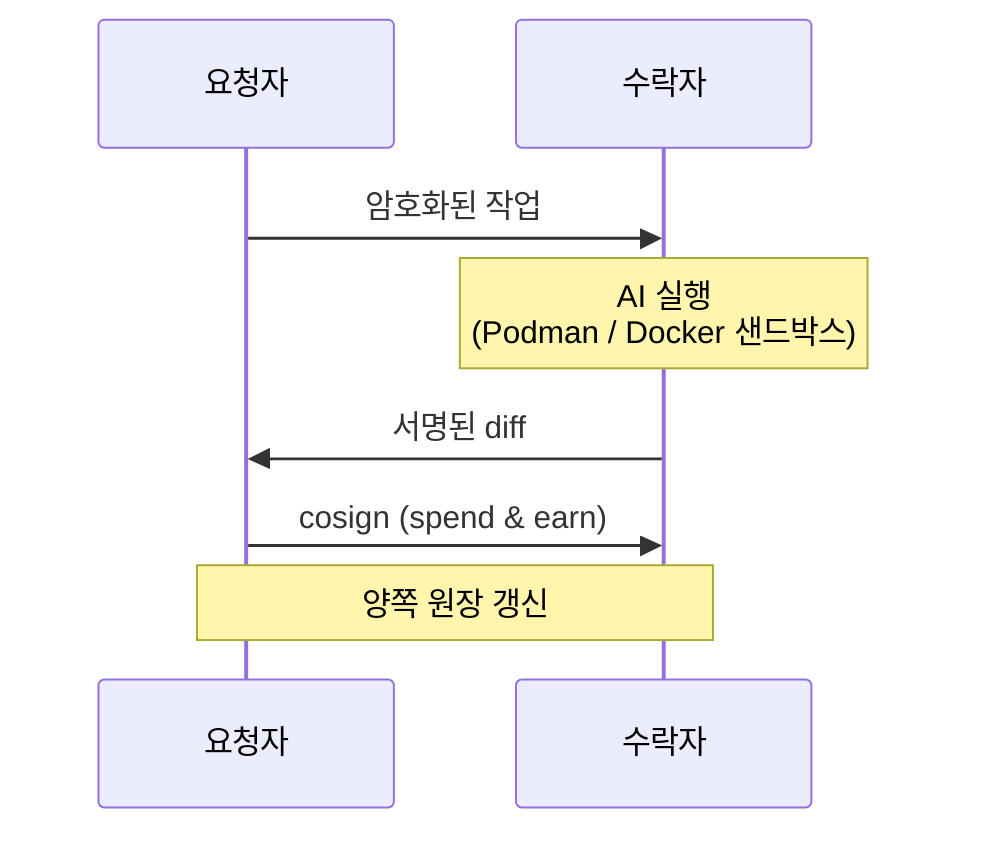

# ash

[English](./README.md)

> 분산형 P2P AI 코딩 에이전트 네트워크 — 유휴 자원을 공유하고 크레딧을 획득, 완전 셀프호스팅.

[](./LICENSE)
[](https://nodejs.org)

Claude Code 월 $100 플랜은 가끔만 쓰는 사람에게 부담스럽습니다. **ash**는 유휴 컴퓨팅 자원을 공유해 크레딧을 벌고, 정작 필요할 때 그 크레딧으로 AI 작업을 돌리게 해줍니다.

작업은 Podman 또는 Docker 샌드박스 안에서 실행되므로, 신뢰할 수 없는 코드로부터 내 머신이 보호됩니다.

ash는 TUI 입니다. 설치 → 실행 → 한 화면 안에서 모든 작업.

---

## 시작하기

### 1. 설치

**npm:**
```bash
npm install -g @doheon/ash
```

**Homebrew (macOS):**
```bash
brew tap doheon/tap
brew install ash
```

설치 후:
```bash
ash init
```

`ash init`이 다음을 안내합니다:
- 사용자명 입력
- AI 에이전트 선택 (Claude Code 또는 Codex)
- AI 프로바이더 로그인 (샌드박스용 장기 토큰 생성)
- Podman / Docker 사용 가능 여부 확인 (`ash serve` 실행 시 필요)

상태는 `~/.ash/`에 저장됩니다. **Node 18+, git, Podman 또는 Docker가 필요합니다.**

### 업데이트

```bash
# npm
npm install -g @doheon/ash@latest

# Homebrew
brew upgrade ash
```

ash는 하루 한 번 업데이트를 확인하고, 새 버전이 있으면 실행 시 알려줍니다.

### 2. TUI 실행

```bash
ash
```

인터랙티브 화면이 뜹니다. 프롬프트를 입력하면 네트워크가 처리할 피어를 찾고, diff가 표시되고, 적용/스킵을 결정할 수 있습니다. **다른 피어가 벌어둔 크레딧을 사용하는 셈입니다.**

```text
❯ refactor cli/main.ts to lazy-import command handlers
  ⎿ packaged  (12.3 KB)
  ⎿ matched · running…
  ⎿ 2 files changed  +18 / -5
  ⎿ Apply? (y=6cr · n=3cr · 60s = 3cr)
```

---

## TUI 안에서

모든 동작은 슬래시 커맨드입니다. `/help`로 전체 목록 확인.

| 슬래시 커맨드 | 동작 |
|--------------|------|
| *(그냥 프롬프트 입력)* | 네트워크에 작업 제출, 크레딧 소비 |
| `/serve [-n N]` | 다른 피어의 작업을 받아 처리하고 크레딧 획득 |
| `/mine [-n N] [쿼리]` | ash 레포에 기여하여 크레딧 획득 |
| `/status` | 사용자명, 잔액, pubkey, 에이전트 로그인 상태 |
| `/history [pubkey]` | earn / spend / mint 이벤트 전체 로그 |
| `/peers` | 온라인 피어와 잔액 |
| `/model <티어>` | 모델 변경 (haiku / sonnet / opus / codex) |
| `/login [에이전트]` | GitHub, Claude Code, Codex 로그인 |
| `/help` | 모든 커맨드 보기 |
| `/quit` | TUI 종료 |

### 크레딧을 버는 두 가지 방법

**`/serve`** — 들어오는 작업을 받아 처리합니다. 요청자의 암호화된 코드를 받아 AI 에이전트를 Podman/Docker 샌드박스에서 실행하고 diff를 돌려보냅니다. 요청자가 diff를 적용하면 로컬 원장에 크레딧이 원자적으로 적립.

**`/mine`** — ash 레포 자체에 기여. 공개 ash 코드베이스에서 동작합니다: 오픈 이슈 구현, PR 리뷰, 증거 있는 버그 리포트 등.

| Mine 액션 | 크레딧 |
|----------|--------|
| 이슈 구현 → PR 생성 | 6 (테스트 추가 시 +3) |
| 이슈 종료 권고 | 2 |
| PR 리뷰 → 승인 | 2 |
| PR 리뷰 → 변경 요청 | 3 |
| PR 리뷰 → 종료 권고 | 2 |
| 자기 PR 자체 개선 | 4 |
| 리뷰어 피드백 반영 | 5 |
| 새 이슈 등록 (쿼리 모드) | 4 |

---

## TUI 없이 사용

스크립트, cron, CI 용도로 모든 TUI 동작에 대응되는 CLI 커맨드가 있습니다.

| 명령어 | 설명 |
|--------|------|
| `ash init` | 첫 설정 (키페어, 사용자명, 에이전트) |
| `ash run "<프롬프트>"` | TUI 없이 일회성 프롬프트 |
| `ash serve [-n N]` | 들어오는 작업을 받아 처리하고 크레딧 획득 |
| `ash serve --allow-self` | 자기 작업도 포함 (테스트용) |
| `ash mine [-n N] [쿼리]` | ash 기여로 크레딧 획득 |
| `ash status` | 신원, 잔액, 에이전트 로그인 상태 |
| `ash history [pubkey]` | earn/spend/mint 이벤트 |
| `ash peers` | 연결된 피어와 잔액 |
| `ash peers --forget <pubkey>` | 오래된 ledger-key 매핑 제거 (피어가 corestore를 초기화한 경우) |
| `ash set <모델>` | 모델 티어 변경 (예: `claude-sonnet`) |
| `ash set github-token <PAT>` | GitHub PAT 저장 |
| `ash login [에이전트]` | GitHub, Claude Code, Codex 로그인 |
| `ash setup` | 환경 재점검 |

---

## ⚠️ v0.1 — 실험판

ash는 1.0 이전입니다. 프로토콜, 원장 포맷, 키 디렉터리는 minor 버전 사이에서도 바뀔 수 있습니다. **민감한 비밀이 있는 머신에서 돌리지 말고, `ash serve`는 일회용 머신에서 사용하며, 크레딧이 중요하다면 `~/.ash/`를 백업하세요.**

- **크레딧은 admin이 발급합니다.** 모든 크레딧은 `admin`이 서명한 `MintEvent`에서 시작합니다. admin 키페어 분실/유출 시 신규 발급 정지 — v0.1에는 분산 대안이 없습니다.
- **가입 자동 민트는 런칭 기간 한정.** `ash admin watch-signups`는 자체 서명한 `SignupEvent`를 broadcast 한 어떤 pubkey 에도 `SIGNUP_BONUS`를 발급합니다 — GitHub 바인딩이나 IP 단위 레이트리밋 없음. admin 이 언제든 watcher 를 끌 수 있고, 부트스트랩 기간에만 운영됩니다.
- **콜드 스타트 시 DHT 부트스트랩이 느립니다** (첫 피어까지 30~90초). 첫 시도에 잔액 검증이 실패하면 재시도하세요.
- **`ash serve`는 샌드박스에서 동작하지만, `ash mine`은 아닙니다.** mine 은 호스트에서 직접 AI 에이전트를 `--dangerously-skip-permissions` / `--dangerously-bypass-approvals-and-sandbox` 와 함께 실행합니다. 악성 PR 또는 이슈 본문의 prompt-injection 으로 사용자 머신의 임의 파일이 읽히거나 변조될 수 있습니다. 첫 `ash mine` 실행 시 확인 프롬프트가 뜨고 sentinel 파일 (`~/.ash/.mine_warning_seen`) 을 생성합니다.
- **샌드박스 네트워크 노출.** `serve`는 에이전트를 Podman 또는 Docker 컨테이너에서 `--cap-drop=ALL`, `--security-opt=no-new-privileges`, `--tmpfs /tmp:noexec,nosuid`, non-root 유저, 에이전트 토큰 read-only 로 실행합니다. 에이전트별로 자기 프로바이더 호스트만 허용: claude → `api.anthropic.com`; codex → `api.openai.com`, `chatgpt.com`. 클라우드 메타데이터 호스트명(`169.254.169.254`, `host.docker.internal` 등)은 loopback 매핑. **Docker (macOS/Windows 기본) 에서는 bridge 네트워크가 호스트 LAN 과 IP-only 메타데이터 endpoint 에 도달 가능.** Linux 의 rootless Podman 권장. Docker 사용 시 `serve` 가 런타임 경고를 출력합니다.
- **요청자가 spend 후 earn-cosign 사이에 크래시하면 한 작업분 크레딧 손실.** 요청자가 SpendEvent 를 로컬에 append 한 뒤, earn:cosign 이 수락자에게 도달하기 전 크래시하면 그 작업의 수락자 적립이 일어나지 않습니다. v0.1 은 이를 known limitation 으로 명시. v0.2 에서 3-message commit 으로 보강 예정.
- **네이티브 의존성.** prebuilt 바이너리가 없는 플랫폼(Alpine, 일부 ARM Linux)에서는 `sodium-native`/`udx-native`가 C 빌드 툴체인을 필요로 합니다. `npm install`이 알려줍니다.
- **수락자는 샌드박스 내에서 코드를 평문으로 읽을 수 있습니다.** 회사 코드나 NDA 적용 자료는 제출하지 마세요.

---

## 동작 방식

ash는 서버가 아닌 P2P입니다. 신원은 디스크에 있는 Ed25519 키페어, 원장은 Hyperswarm으로 복제되는 append-only Hypercore.



**핵심 속성:**

- **종단간 암호화** — 코드/diff는 AES-256-GCM, 키 교환은 RSA-OAEP. AAD가 각 ciphertext를 `(task_id, requester_pubkey)`에 바인딩.
- **서명 append-only 로그** — 모든 이벤트는 Ed25519 서명되어 `~/.ash/corestore/` 하위 유저별 Hypercore에 저장. 잔액 검증을 위해 전용 `LEDGER_TOPIC`으로 서로의 코어를 복제.
- **원자적 정산** — diff 도착 + 양쪽 cross-sign 이후에만 크레딧 이동. double-spend, half-state 없음.
- **샌드박스 수락자** — `--cap-drop=ALL`, `--security-opt=no-new-privileges`, `/tmp`은 `tmpfs noexec,nosuid`, non-root 유저, 에이전트 토큰은 read-only 마운트, 클라우드 메타데이터 DNS는 loopback 매핑.
- **신원 바인딩 earn** — 카운터파티가 admin 서명 `MintEvent`를 가졌을 때만 earn 적립. throwaway 키페어 위조는 replay 시점에 거부.
- **채널 바인딩 핸드셰이크** — 모든 연결의 Ed25519 챌린지가 Noise transport key를 함께 서명. relay/MITM이 두 세션을 프록시할 수 없음.

위조 방지 ([`core/ledger/events.ts`](core/ledger/events.ts))는 다음을 강제합니다:
1. `SpendEvent`는 log 소유자가 서명.
2. `EarnEvent`는 `counterparty_pubkey`가 서명.
3. 각 `EarnEvent`에 대응되는 `SpendEvent`가 카운터파티 log에 존재.
4. 카운터파티는 유효한 admin `MintEvent`를 1개 이상 보유.

---

## 아키텍처 상세

### 디스크 레이아웃

```
~/.ash/
├── config.json                    # 사용자명, pubkey, 모델 티어, 에이전트
├── keys/
│   ├── identity.ed25519           # Ed25519 원장 서명 키
│   ├── identity.ed25519.pub
│   └── rsa/<pubkey>.pem           # 작업당 AES 키 교환용 RSA-OAEP
├── corestore/                     # Hypercore append-only 이벤트 로그
├── codex-session/                 # 격리된 Codex 세션 (사용 시)
└── peer_ledger_keys.json          # pubkey → ledger-core-key 캐시
```

이전 빌드는 RSA 키를 `~/.agent-share/keys/`에 저장. ash가 업그레이드 후 첫 실행 시 자동 마이그레이션.

### 피어 발견

Hyperswarm DHT, 고정 토픽 `sha256("ash-network-v1")`. 피어가 join → announce → `peer:hello` 교환 (Noise transport key + protocol version에 바인딩된 Ed25519 챌린지) → 이후 task-scoped 메시지 통신.

### 샌드박스

수락자는 AI 에이전트를 Podman 또는 Docker 컨테이너에서 실행:

- `--cap-drop=ALL`
- `--security-opt=no-new-privileges`
- `--tmpfs /tmp:rw,noexec,nosuid,size=100m`
- non-root `sandboxuser`
- 에이전트 토큰은 `/run/secrets/agent-token`에 read-only 마운트
- `--add-host` 엔트리로 클라우드 메타데이터 DNS는 `127.0.0.1`로 매핑

### 정책

경제 파라미터는 [`shared/policy.ts`](shared/policy.ts)에 정의.

| 파라미터 | 값 | 설명 |
|---------|----|------|
| `SIGNUP_BONUS` | 100 | 신규 사용자에게 발급되는 admin 서명 `MintEvent` |
| `FEE_BPS` | 0 | 플랫폼 수수료 (basis points; 100 = 1%) |
| `MODEL_CREDITS` | haiku 2 · sonnet 6 · opus 30 · codex 2 | 작업당 크레딧 |

가입 보너스 흐름:
1. `ash init`이 서명된 `SignupEvent`를 사용자의 Hypercore에 append.
2. 코디네이터(`ash admin watch-signups`)가 online인 동안 사용자가 네트워크에 join하면, 코디네이터가 signup을 검증하고 admin Hypercore에 `MintEvent { reason: "signup", amount: 100 }`을 append.
3. 다음 `ash status`에서 크레딧이 반영. replay는 recipient당 1회만 인정 → 버그 있는 watcher가 중복 발급 못 함.

코디네이터는 다음을 실행:

```bash
ash admin watch-signups
ash admin watch-signups --bonus 50  # 오버라이드
```

watcher는 `~/.ash/keys/admin.ed25519`에 admin 키페어가 있어야 동작.

---

## 문제 해결

### `not initialized`
먼저 `ash init` 실행.

### 작업이 클레임되지 않음
- 최소 한 명의 피어가 `ash serve`를 실행 중인지 확인
- 콜드 스타트 시 DHT 부트스트랩이 30~90초 걸릴 수 있음 — 재시도
- 방화벽이 UTP/UDP를 허용해야 함

### 핸드셰이크 디버그 로그

피어가 조용히 끊어진다면:
```bash
ASH_DEBUG_SWARM=1 ash
```

### 와이어 프로토콜 비호환
v0.1.0은 protocol version 1을 사용합니다. 버전이 정확히 일치해야 함 — 이 숫자가 올라가면 모든 피어가 함께 업그레이드해야 합니다.

### 잔액이 갱신되지 않음
1. `ash history`로 earn/spend가 기록됐는지 확인
2. 다른 머신과의 잔액 검증은 admin 코어 복제가 필요 — 갓 시작한 수락자의 첫 earn은 복제가 따라잡기 전까지 `0`으로 보일 수 있음. `ash status`를 재시도.
3. 피어가 corestore를 초기화한 경우 `ash peers --forget <pubkey>`로 오래된 매핑 제거

### 에이전트 로그인 만료
`ash login` (또는 TUI 안에서 `/login`).

### Podman 오류
```bash
podman run --rm alpine echo "ok"
```
Podman 이 망가졌거나 사용 불가하면 `ash setup` 을 재실행해서 Docker 를 선택하세요. Docker 의 bridge 네트워크는 호스트 LAN 을 노출합니다 (위 "샌드박스 네트워크 노출" 참조).

### Corestore 잠김
다른 `ash` 프로세스가 이미 실행 중. 종료시키거나, 이전 실행이 비정상 종료된 경우 다음 시작 시 자동 정리됩니다.

---

## 소스에서 설치

```bash
git clone https://github.com/Doheon/agent-share
cd agent-share
npm install
npm install -g .
ash init
```

## 개발

```bash
npm run dev    # tsx로 CLI 실행
npm test       # vitest 실행
npm run build  # 배포용 tarball 빌드 (npm pack)
```

---

## 라이선스

MIT
