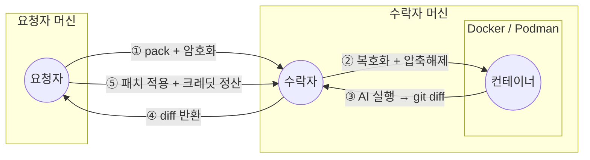

# ash

[English](./README.md)

> 분산형 P2P AI 코딩 에이전트 네트워크 — 유휴 자원을 공유하고 크레딧을 획득, 완전 셀프호스팅.

[](https://www.npmjs.com/package/@doheon/ash)
[](./LICENSE)
[](https://nodejs.org)

<!-- GIF HERE -->

*ash TUI에서 프롬프트를 입력하면 피어가 AI 에이전트를 실행하고 diff를 반환합니다.*



*코드는 요청자 머신에서 암호화되어 전송되고, 수락자의 격리된 컨테이너 안에서 실행된 뒤 diff만 반환됩니다.*

**ash**는 P2P 네트워크입니다. 다른 사람의 AI 작업을 처리해주고 크레딧을 벌고, 그 크레딧으로 내 코딩을 자동화합니다. 구독료 없음, 중앙 서버 없음.

- Claude Code 사용 한도에 막혔나요? 벌어둔 크레딧으로 계속 사용
- `ash serve`를 돌리는 동안 → 크레딧 획득
- 프롬프트를 입력하면 → 피어가 AI 에이전트를 실행 → diff 수신
- **Claude Code**와 **Codex** 모두 지원

---

## 시작하기

### 1. 설치

**npm:**
```bash
npm install -g @doheon/ash
```

**Homebrew (macOS):**
```bash
brew tap doheon/tap
brew install ash
```

### 2. 초기화

```bash
ash init
```

순서대로 안내합니다: 사용자명 → 에이전트 선택 (Claude Code 또는 Codex) → 로그인 → 환경 확인.

**처음 네트워크에 접속하면 100 크레딧이 자동으로 지급됩니다.**

상태는 `~/.ash/`에 저장됩니다. **Node 18+, git, Podman 또는 Docker가 필요합니다.**

### 3. TUI 실행

```bash
ash
```

한 화면 안에서 모든 작업. 프롬프트를 입력해 작업을 제출하거나, `/serve`로 크레딧 획득을 시작하세요.

```text
❯ refactor cli/main.ts to lazy-import command handlers
  ⎿ packaged  (12.3 KB)
  ⎿ matched · running…
  ⎿ 2 files changed  +18 / -5
  ⎿ Apply? (y=6cr · n=3cr · 60s = 3cr)
```

### 업데이트

```bash
# npm
npm install -g @doheon/ash@latest

# Homebrew
brew update && brew upgrade ash
```

ash는 하루 한 번 업데이트를 확인하고, 새 버전이 있으면 실행 시 알려줍니다.

---

## 커맨드

| 슬래시 커맨드 | 동작 |
|--------------|------|
| *(그냥 프롬프트 입력)* | 네트워크에 작업 제출, 크레딧 소비 |
| `/serve [-n N]` | 다른 피어의 작업을 받아 처리하고 크레딧 획득 |
| `/mine [-n N] [쿼리]` | ash 레포에 기여하여 크레딧 획득 |
| `/status` | 사용자명, 잔액, pubkey, 에이전트 로그인 상태 |
| `/history [pubkey]` | earn / spend / mint 이벤트 전체 로그 |
| `/peers` | 온라인 피어와 잔액 |
| `/model <티어>` | 모델 변경 (haiku / sonnet / opus / codex) |
| `/login [에이전트]` | GitHub, Claude Code, Codex 로그인 |
| `/help` | 모든 커맨드 보기 |
| `/quit` | TUI 종료 |

---

## 크레딧을 버는 두 가지 방법

### `/serve` — 피어의 작업을 처리

요청자의 암호화된 코드를 받아 AI 에이전트를 Podman/Docker 샌드박스에서 실행하고 서명된 diff를 돌려보냅니다. 요청자가 diff를 적용하면 로컬 원장에 크레딧이 원자적으로 적립됩니다.

작업은 `--cap-drop=ALL`, non-root 유저, AI 프로바이더 호스트만 허용된 샌드박스에서 실행됩니다. **신뢰할 수 없는 코드가 내 머신에 직접 닿지 않습니다.**

### `/mine` — ash 레포에 기여

공개 ash 코드베이스에서 AI 에이전트를 실행합니다: 오픈 이슈 구현, PR 리뷰, 버그 리포트 등.

| Mine 액션 | 크레딧 |
|----------|--------|
| 이슈 구현 → PR 생성 | 6 (테스트 추가 시 +3) |
| 이슈 종료 권고 | 2 |
| PR 리뷰 → 승인 | 2 |
| PR 리뷰 → 변경 요청 | 3 |
| PR 리뷰 → 종료 권고 | 2 |
| 자기 PR 자체 개선 | 4 |
| 리뷰어 피드백 반영 | 5 |
| 새 이슈 등록 (쿼리 모드) | 4 |

> **주의:** `ash mine`은 샌드박스 없이 호스트에서 직접 실행됩니다. 악성 이슈나 PR 본문의 prompt-injection으로 파일이 읽히거나 변조될 수 있습니다. 첫 실행 전 경고 프롬프트가 표시됩니다.

---

## CLI (TUI 없이)

스크립트, cron, CI 용도:

| 명령어 | 설명 |
|--------|------|
| `ash init` | 첫 설정 |
| `ash run "<프롬프트>"` | TUI 없이 일회성 프롬프트 |
| `ash serve [-n N]` | 들어오는 작업을 받아 처리하고 크레딧 획득 |
| `ash mine [-n N] [쿼리]` | ash 기여로 크레딧 획득 |
| `ash status` | 신원, 잔액, 에이전트 로그인 상태 |
| `ash history [pubkey]` | earn/spend/mint 이벤트 |
| `ash peers` | 연결된 피어와 잔액 |
| `ash set <모델>` | 모델 티어 변경 (예: `claude-sonnet`) |
| `ash login [에이전트]` | GitHub, Claude Code, Codex 로그인 |

---

## 동작 방식

ash는 서버가 아닌 P2P입니다. 신원은 디스크에 있는 Ed25519 키페어, 원장은 Hyperswarm으로 복제되는 append-only Hypercore.


**단계별 설명:**

**요청자**
1. `.gitignore` 패턴을 모든 하위 디렉토리까지 적용해 파일을 tar로 패키징
2. AES-256-GCM 키 생성 후 tar 암호화, Hyperswarm으로 작업 공지
3. `task:claim` 수신 시 수락자의 RSA-OAEP 공개키로 AES 키를 암호화해 전송
4. diff를 받아 리뷰하고 승인하면 로컬 파일에 패치 적용
5. spend 이벤트에 서명, 로컬 원장에서 크레딧 차감

**수락자**
1. 작업을 claim하고 자신의 RSA 공개키 전송 (본인만 AES 키를 복호화 가능)
2. 암호화된 blob 수신, AES 키로 복호화 후 temp 디렉토리에 압축 해제
3. Docker/Podman 컨테이너 안에서 AI 에이전트 실행 — 네트워크는 AI 프로바이더만 허용
4. 에이전트가 수정한 내용을 `git diff`로 추출
5. diff 전송 후 temp 디렉토리와 컨테이너 즉시 삭제
6. 요청자 승인 시 earn 이벤트에 서명, 로컬 원장에 크레딧 적립

**핵심 속성:**

- **종단간 암호화** — 코드/diff는 AES-256-GCM, 키 교환은 RSA-OAEP
- **서명 append-only 로그** — 모든 이벤트는 Ed25519 서명 후 유저별 Hypercore에 저장; 피어끼리 복제해 잔액 검증
- **원자적 정산** — diff 도착 + 양쪽 cross-sign 이후에만 크레딧 이동
- **위조 방지** — 카운터파티가 admin 서명 MintEvent를 가졌을 때만 earn 적립; throwaway 키페어 공격은 replay 시점에 거부

---

## ⚠️ v0.1 — 실험판

- 프로토콜, 원장 포맷, 키 디렉터리는 minor 버전 사이에서도 바뀔 수 있습니다
- 수락자는 샌드박스 내에서 코드를 평문으로 읽을 수 있습니다. 회사 코드나 NDA 적용 자료는 제출하지 마세요
- `ash mine`은 샌드박스 없음 — 신뢰할 수 없는 레포에서 주의
- **Docker (macOS/Windows 기본)** 에서는 bridge 네트워크가 호스트 LAN에 접근 가능. Linux의 rootless Podman 권장
- 요청자가 spend 후 earn-cosign 전 크래시하면 그 작업분 크레딧 손실 (v0.1 known limitation)

---

## 아키텍처 상세

### 디스크 레이아웃

```
~/.ash/
├── config.json                    # 사용자명, pubkey, 모델 티어, 에이전트
├── keys/
│   ├── identity.ed25519           # Ed25519 원장 서명 키
│   ├── identity.ed25519.pub
│   └── rsa/<pubkey>.pem           # 작업당 AES 키 교환용 RSA-OAEP
├── corestore/                     # Hypercore append-only 이벤트 로그
└── peer_ledger_keys.json          # pubkey → ledger-core-key 캐시
```

### 피어 발견

Hyperswarm DHT, 고정 토픽 `sha256("ash-network-v1")`. 피어가 join → announce → `peer:hello` 교환 (Noise transport key + protocol version에 바인딩된 Ed25519 챌린지).

### 샌드박스

수락자는 AI 에이전트를 Podman 또는 Docker 컨테이너에서 실행:

- `--cap-drop=ALL`, `--security-opt=no-new-privileges`
- `--tmpfs /tmp:rw,noexec,nosuid,size=100m`
- Non-root `sandboxuser`
- 에이전트 토큰은 `/run/secrets/agent-token`에 read-only 마운트
- 클라우드 메타데이터 DNS는 `127.0.0.1`로 매핑

### 정책

경제 파라미터는 [`shared/policy.ts`](shared/policy.ts)에 정의.

| 파라미터 | 값 | 설명 |
|---------|----|------|
| `SIGNUP_BONUS` | 100 cr | 첫 네트워크 접속 시 자동 지급 |
| `FEE_BPS` | 0 | 플랫폼 수수료 (basis points) |
| `MODEL_CREDITS` | haiku 2 · sonnet 6 · opus 30 · codex 2 | 작업당 크레딧 |

---

## 문제 해결

### 작업이 클레임되지 않음
- 최소 한 명의 피어가 `ash serve`를 실행 중인지 확인
- 콜드 스타트 시 DHT 부트스트랩이 30~90초 걸릴 수 있음 — 재시도
- 방화벽이 UTP/UDP를 허용해야 함

### earn 후 잔액이 0
1. `ash history`로 earn이 기록됐는지 확인
2. 잔액 검증은 admin 코어 복제가 필요 — 몇 초 후 `ash status` 재시도
3. 피어가 corestore를 초기화한 경우: `ash peers --forget <pubkey>`

### 에이전트 로그인 만료
`ash login` (또는 TUI 안에서 `/login`).

### Podman 오류
```bash
podman run --rm alpine echo "ok"
```
사용 불가하면 `ash setup`을 재실행해서 Docker를 선택하세요.

### Corestore 잠김
다른 `ash` 프로세스가 실행 중. 먼저 종료하세요.

### 스웜 디버그
```bash
ASH_DEBUG_SWARM=1 ash
```

---

## 소스에서 설치

```bash
git clone https://github.com/Doheon/agent-share
cd agent-share
npm install
npm install -g .
ash init
```

```bash
npm run dev    # tsx로 CLI 실행
npm test       # vitest 실행
npm run build  # 배포용 tarball 빌드
```

---

## 라이선스

MIT
