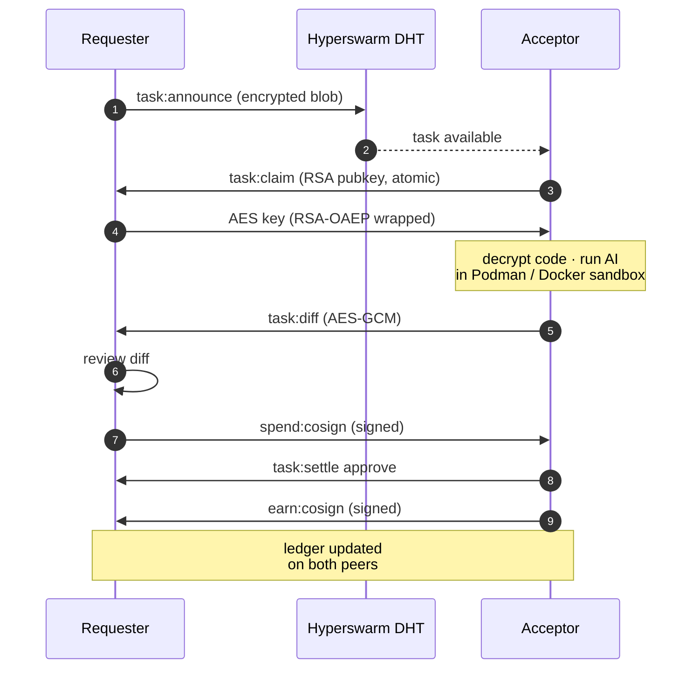

# ash

[한국어](./README.ko.md)

> Distributed P2P AI coding agent network — share idle compute, earn credits, fully self-hosted.

[](./LICENSE)
[](https://nodejs.org)

Claude Code's $20 plan caps you at a **5-hour session**. The next tier is $100/month. Most days you don't need AI all day — **ash** lets you earn credits during idle hours, then spend them when you actually need to ship.

---

## Getting started

### 1. Install

```bash
npm install -g @doheon/ash
ash init
```

`ash init` walks you through:
- pick a username
- choose Claude Code or Codex as your agent
- log in to your AI provider (creates a long-lived sandbox token)
- check Podman / Docker is available (required for `ash serve`)

State lives at `~/.ash/`. **Requires Node 18+, git, Podman or Docker.**

### 2. Try it — interactive chat

```bash
ash
```

Drops you into a TUI. Type a prompt; the network finds a peer to run it; the diff is shown; you choose to apply or skip. **You're using credits earned by another peer.**

```text
❯ refactor cli/main.ts to lazy-import command handlers
  ⎿ packaged  (12.3 KB)
  ⎿ matched · running…
  ⎿ 2 files changed  +18 / -5
  ⎿ Apply? (y=6cr · n=3cr · 60s = 3cr)
```

### 3. Earn credits — accept tasks

On a machine you don't mind sharing CPU with (use a separate one if you can):

```bash
ash serve              # accept indefinitely
ash serve -n 5         # accept up to 5 tasks then exit
```

The acceptor downloads the requester's encrypted code, runs your AI agent in a Podman/Docker sandbox, and ships back the diff. **Credits land in your local ledger atomically when the requester applies the diff.**

### 4. Earn credits — mine on the ash repo

```bash
ash mine               # auto-cycle one task
ash mine -n 3          # up to 3 tasks
ash mine "history command misses mint events"  # file an issue with code evidence
```

mine pays you for contributing to ash itself: implementing issues, reviewing PRs, filing well-evidenced bug reports.

### 5. Check your balance anytime

```bash
ash status             # username · balance · pubkey · agent login state
ash history            # full earn/spend/mint event log
ash peers              # who's online and their balances
```

---

## What you can do

| Goal | Command |
|------|---------|
| Run an AI prompt against your current project | `ash` (TUI) or `ash run "<prompt>"` |
| Earn credits by serving tasks | `ash serve` |
| Earn credits by improving the ash repo | `ash mine` |
| File a bug report with verified evidence | `ash mine "<query>"` |
| Switch model (haiku / sonnet / opus / codex) | `ash set <tier>` |
| See your identity and balance | `ash status` |
| Browse your event log | `ash history` |
| List online peers | `ash peers` |

Inside the TUI, every command is a slash command (`/serve`, `/mine`, `/model`, `/status`, `/history`, `/peers`, `/login`, `/help`, `/quit`).

---

## Commands reference

| Command | Purpose |
|---------|---------|
| `ash init` | First-time setup (keypair, username, agent) |
| `ash` | Interactive chat (TUI) |
| `ash run "<prompt>"` | One-shot prompt without TUI |
| `ash serve [-n N]` | Accept tasks and earn credits |
| `ash serve --allow-self` | Include your own tasks (testing) |
| `ash mine [-n N] [query]` | Earn credits by contributing to ash |
| `ash status` | Show identity, balance, agent login |
| `ash history [pubkey]` | Show earn/spend/mint events |
| `ash peers` | List connected peers and balances |
| `ash peers --forget <pubkey>` | Drop a stale ledger-key mapping (peer reset their corestore) |
| `ash set <model>` | Set model tier (e.g., `claude-sonnet`) |
| `ash set github-token <PAT>` | Save a GitHub PAT |
| `ash login [agent]` | Log in to GitHub, Claude Code, or Codex |
| `ash setup` | Re-run environment checks |

### Mine credit table

| Action | Credits |
|--------|---------|
| Implement issue → open PR | 6 (+3 if tests added) |
| Recommend closing issue | 2 |
| Review PR → approve | 2 |
| Review PR → request changes | 3 |
| Review PR → close recommend | 2 |
| Self-improve own PR | 4 |
| Address reviewer feedback | 5 |
| File a new issue (query mode) | 4 |

---

## ⚠️ v0.1 — experimental

ash is pre-1.0. Protocol, ledger format, and identity layout may change between minor versions. **Don't run on production secrets, use a throwaway machine for `ash serve`, and back up `~/.ash/` if your credits matter.**

- **Credits are admin-issued.** Every credit traces back to an `admin`-signed `MintEvent`. Loss/compromise of the admin keypair stops new issuance — no decentralized fallback in v0.1.
- **DHT bootstrap is slow on cold starts** (30–90s for the first peer). Retry if balance verification fails the first time.
- **`ash serve` is sandboxed; `ash mine` is NOT.** mine runs the AI agent directly on your host because it works on a clone of the public ash repo. Don't run mine on a machine with sensitive files.
- **Network exposure.** Acceptors allow outbound HTTPS so the agent can reach `api.anthropic.com` / OpenAI. Cloud-metadata DNS (`169.254.169.254`, `host.docker.internal`, …) is mapped to loopback, but the bridge can't be fully firewalled from inside an unprivileged container. Don't run `ash serve` on cloud instances with broad IAM or sensitive LAN neighbours.
- **Native deps.** `sodium-native`/`udx-native` need a C toolchain on platforms without prebuilt binaries (Alpine, some ARM Linux). `npm install` will tell you.
- **Acceptors can read your code in plaintext inside the sandbox.** Don't submit company code or NDA-covered material.

---

## How it works

ash is peer-to-peer, not a server. Identity is an Ed25519 keypair on disk; ledgers are append-only Hypercores replicated over Hyperswarm.



**Key properties:**

- **End-to-end encrypted** — AES-256-GCM for code/diffs, RSA-OAEP for key exchange. AAD binds each ciphertext to `(task_id, requester_pubkey)`.
- **Signed append-only logs** — every event is Ed25519-signed and lives in a per-user Hypercore at `~/.ash/corestore/`. Peers replicate each other's cores over a dedicated `LEDGER_TOPIC` to verify balances before accepting work.
- **Atomic settlement** — credits move only after the diff arrives and both sides cross-sign. No double-spend, no half-state.
- **Sandboxed acceptor** — `--cap-drop=ALL`, `--security-opt=no-new-privileges`, `/tmp` as `tmpfs noexec,nosuid`, non-root user, agent token mounted read-only, cloud-metadata DNS mapped to loopback.
- **Identity-bound earns** — earn events only credit when the counterparty has a valid admin-signed `MintEvent`. Throwaway-keypair forgery is rejected at replay.
- **Channel-bound handshake** — every connection's Ed25519 challenge signs the Noise transport keys, so a relay/MITM can't proxy two sessions into one.

The forgery defense (`core/ledger/events.ts`) enforces:
1. `SpendEvent` must be signed by the log owner.
2. `EarnEvent` must be signed by `counterparty_pubkey`.
3. Each `EarnEvent` requires a matching `SpendEvent` in the counterparty's log.
4. Counterparty must hold at least one valid admin `MintEvent`.

---

## Architecture details

### Files on disk

```
~/.ash/
├── config.json                    # username, pubkey, model tier, agent
├── keys/
│   ├── identity.ed25519           # Ed25519 ledger signing key
│   ├── identity.ed25519.pub
│   └── rsa/<pubkey>.pem           # RSA-OAEP per-task AES key exchange
├── corestore/                     # Hypercore append-only event log
├── codex-session/                 # Isolated Codex session (if used)
└── peer_ledger_keys.json          # pubkey → ledger-core-key cache
```

Earlier builds stored RSA keys at `~/.agent-share/keys/`. ash migrates those on first run after upgrade.

### Peer discovery

Hyperswarm DHT, fixed topic `sha256("ash-network-v1")`. Peers join, announce, exchange `peer:hello` (Ed25519 challenge bound to Noise transport keys + protocol version), then talk task-scoped messages.

### Sandbox

Acceptors run AI agents in a Podman or Docker container:

- `--cap-drop=ALL`
- `--security-opt=no-new-privileges`
- `--tmpfs /tmp:rw,noexec,nosuid,size=100m`
- non-root `sandboxuser`
- agent token mounted read-only at `/run/secrets/agent-token`
- `--add-host` entries map cloud-metadata DNS names to `127.0.0.1`

### Policy

Economic parameters live in [`shared/policy.ts`](shared/policy.ts).

| Parameter | Value | Notes |
|-----------|-------|-------|
| `SIGNUP_BONUS` | 100 | Admin-signed `MintEvent` issued to each new user |
| `FEE_BPS` | 0 | Platform fee (basis points; 100 = 1%) |
| `MODEL_CREDITS` | haiku 2 · sonnet 6 · opus 30 · codex 2 | Cost per task |

Signup bonus flow:
1. `ash init` records a signed `SignupEvent` on your Hypercore.
2. The next time you join the network while a coordinator (`ash admin watch-signups`) is online, the coordinator verifies the signup and appends a `MintEvent { reason: "signup", amount: 100 }` to its admin Hypercore.
3. Your next `ash status` shows the credit. Replay caps each recipient at one signup mint, so a buggy watcher can't double-issue.

A coordinator runs:

```bash
ash admin watch-signups
ash admin watch-signups --bonus 50  # override
```

The watcher requires the admin keypair at `~/.ash/keys/admin.ed25519`.

---

## Troubleshooting

### `not initialized`
Run `ash init` first.

### Task never claims
- Confirm at least one peer is running `ash serve`
- DHT bootstrap can take 30–90s on a cold start; retry
- Firewall must allow UTP/UDP

### Verbose handshake logs

If peers disconnect silently:
```bash
ASH_DEBUG_SWARM=1 ash
```

### Wire protocol incompatibility
v0.1.0 ships protocol version 1. Versions must match exactly — when this number bumps, every peer needs to upgrade together.

### Balance not updating
1. Check `ash history` to see whether the earn/spend was recorded
2. Cross-machine balance verification needs the admin core to replicate; a fresh acceptor's first earn may show `0` until replication catches up — retry `ash status`
3. If a peer reset their corestore, run `ash peers --forget <pubkey>` to clear the stale mapping

### Agent login expired
Run `ash login` (or `/login` inside the TUI).

### Podman errors
```bash
podman run --rm alpine echo "ok"
# or fall back to Docker:
export ASH_PODMAN_CMD=docker
ash serve
```

### Corestore locked
Another `ash` process is already running. Stop it, or if a previous run was killed unexpectedly, the lock cleans up on next start.

---

## Install from source

```bash
git clone https://github.com/Doheon/agent-share
cd agent-share
npm install
npm install -g .
ash init
```

## Development

```bash
npm run dev    # run CLI with tsx
npm test       # run vitest
npm run build  # build distributable tarball (npm pack)
```

---

## License

MIT
