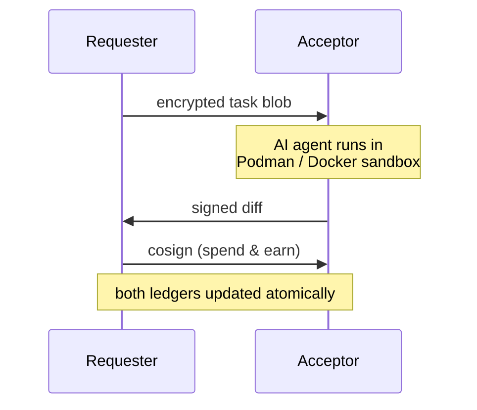

# ash

[한국어](./README.ko.md)

> Distributed P2P AI coding agent network — share idle compute, earn credits, fully self-hosted.

[](https://www.npmjs.com/package/@doheon/ash)
[](./LICENSE)
[](https://nodejs.org)


**ash** is a peer-to-peer network where anyone can earn AI credits by running tasks for others, then spend those credits to get their own code written — no subscription, no central server.

- Run `ash serve` while you sleep → earn credits
- Type a prompt → a peer runs your AI agent → you get a diff
- Works with **Claude Code** and **Codex**

---

## Getting started

### 1. Install

**npm:**
```bash
npm install -g @doheon/ash
```

**Homebrew (macOS):**
```bash
brew tap doheon/tap
brew install ash
```

### 2. Initialize

```bash
ash init
```

Walks you through: username → agent (Claude Code or Codex) → login → environment check.

**You get 100 credits automatically** the first time you join the network.

State lives at `~/.ash/`. **Requires Node 18+, git, and Podman or Docker.**

### 3. Launch the TUI

```bash
ash
```

One screen. Type a prompt to submit a task, or `/serve` to start earning.

```text
❯ refactor cli/main.ts to lazy-import command handlers
  ⎿ packaged  (12.3 KB)
  ⎿ matched · running…
  ⎿ 2 files changed  +18 / -5
  ⎿ Apply? (y=6cr · n=3cr · 60s = 3cr)
```

### Updating

```bash
# npm
npm install -g @doheon/ash@latest

# Homebrew
brew update && brew upgrade ash
```

ash checks for updates once a day and prints a notice when a newer version is available.

---

## Commands

| Slash command | What it does |
|---------------|--------------|
| *(just type a prompt)* | Submit a task to the network and spend credits |
| `/serve [-n N]` | Earn credits by accepting other peers' tasks |
| `/mine [-n N] [query]` | Earn credits by contributing to the ash repo |
| `/status` | Show username, balance, pubkey, agent login state |
| `/history [pubkey]` | Show full earn / spend / mint event log |
| `/peers` | List online peers and their balances |
| `/model <tier>` | Switch model (haiku / sonnet / opus / codex) |
| `/login [agent]` | Log in to GitHub, Claude Code, or Codex |
| `/help` | Show all commands |
| `/quit` | Exit the TUI |

---

## Two ways to earn

### `/serve` — run tasks for peers

Your machine downloads the requester's encrypted code, runs the AI agent in a Podman/Docker sandbox, and ships back a signed diff. Credits land in your local ledger the moment the requester applies it.

Tasks run inside a sandbox with `--cap-drop=ALL`, non-root user, and only the AI provider's host whitelisted. **Your machine is never exposed to untrusted code directly.**

### `/mine` — contribute to ash itself

mine runs the AI agent against the public ash codebase: implement open issues, review PRs, file bug reports.

| Mine action | Credits |
|-------------|---------|
| Implement issue → open PR | 6 (+3 if tests added) |
| Recommend closing issue | 2 |
| Review PR → approve | 2 |
| Review PR → request changes | 3 |
| Review PR → close recommend | 2 |
| Self-improve own PR | 4 |
| Address reviewer feedback | 5 |
| File a new issue (query mode) | 4 |

> **Note:** `ash mine` runs the AI agent directly on your host with full permissions. A prompt-injection in a malicious issue or PR body could read or modify files on your machine. ash prints a one-time warning before the first run.

---

## CLI (no TUI)

For scripts, cron jobs, and CI:

| Command | Purpose |
|---------|---------|
| `ash init` | First-time setup |
| `ash run "<prompt>"` | One-shot prompt without the TUI |
| `ash serve [-n N]` | Accept tasks and earn credits |
| `ash mine [-n N] [query]` | Earn credits by contributing to ash |
| `ash status` | Show identity, balance, agent login |
| `ash history [pubkey]` | Show earn/spend/mint events |
| `ash peers` | List connected peers and balances |
| `ash set <model>` | Set model tier (e.g., `claude-sonnet`) |
| `ash login [agent]` | Log in to GitHub, Claude Code, or Codex |

---

## How it works

ash is peer-to-peer, not a server. Identity is an Ed25519 keypair on disk; ledgers are append-only Hypercores replicated over Hyperswarm.



**Key properties:**

- **End-to-end encrypted** — AES-256-GCM for code/diffs, RSA-OAEP for key exchange
- **Signed append-only logs** — every event is Ed25519-signed in a per-user Hypercore; peers replicate each other's cores to verify balances
- **Atomic settlement** — credits move only after the diff arrives and both sides cross-sign
- **Forgery-resistant** — earn events only count when the counterparty has a valid admin-signed MintEvent; throwaway-keypair attacks are rejected at replay time

---

## ⚠️ v0.1 — experimental

- Protocol, ledger format, and identity layout may change between minor versions
- Don't submit company code or NDA-covered material — acceptors can read your code inside the sandbox
- `ash mine` is not sandboxed; be careful with untrusted repos
- **On Docker (default on macOS/Windows)**, the bridge network can reach the host LAN. Rootless Podman on Linux is recommended for `serve`
- If a requester crashes between spend and earn-cosign, that task's credit is lost for the acceptor (known v0.1 limitation)

---

## Architecture details

### Files on disk

```
~/.ash/
├── config.json                    # username, pubkey, model tier, agent
├── keys/
│   ├── identity.ed25519           # Ed25519 ledger signing key
│   ├── identity.ed25519.pub
│   └── rsa/<pubkey>.pem           # RSA-OAEP per-task AES key exchange
├── corestore/                     # Hypercore append-only event log
└── peer_ledger_keys.json          # pubkey → ledger-core-key cache
```

### Peer discovery

Hyperswarm DHT, fixed topic `sha256("ash-network-v1")`. Peers exchange a `peer:hello` message with an Ed25519 challenge bound to the Noise transport keys and protocol version.

### Sandbox

Acceptors run AI agents in a Podman or Docker container:

- `--cap-drop=ALL`, `--security-opt=no-new-privileges`
- `--tmpfs /tmp:rw,noexec,nosuid,size=100m`
- Non-root `sandboxuser`
- Agent token mounted read-only at `/run/secrets/agent-token`
- Cloud-metadata DNS (`169.254.169.254`, `host.docker.internal`, …) mapped to loopback

### Policy

Economic parameters live in [`shared/policy.ts`](shared/policy.ts).

| Parameter | Value | Notes |
|-----------|-------|-------|
| `SIGNUP_BONUS` | 100 cr | Issued automatically on first network join |
| `FEE_BPS` | 0 | Platform fee (basis points) |
| `MODEL_CREDITS` | haiku 2 · sonnet 6 · opus 30 · codex 2 | Cost per task |

---

## Troubleshooting

### Task never claims
- Confirm at least one peer is running `ash serve`
- DHT bootstrap can take 30–90s on a cold start — retry
- Firewall must allow UTP/UDP

### Balance shows 0 after earning
1. Check `ash history` to confirm the earn was recorded
2. Balance verification requires the admin core to replicate; retry `ash status` after a few seconds
3. If a peer reset their corestore: `ash peers --forget <pubkey>`

### Agent login expired
Run `ash login` (or `/login` inside the TUI).

### Podman errors
```bash
podman run --rm alpine echo "ok"
```
If broken, run `ash setup` and switch to Docker.

### Corestore locked
Another `ash` process is running. Stop it first.

### Debug swarm
```bash
ASH_DEBUG_SWARM=1 ash
```

---

## Install from source

```bash
git clone https://github.com/Doheon/agent-share
cd agent-share
npm install
npm install -g .
ash init
```

```bash
npm run dev    # run CLI with tsx
npm test       # run vitest
npm run build  # build distributable tarball
```

---

## License

MIT
